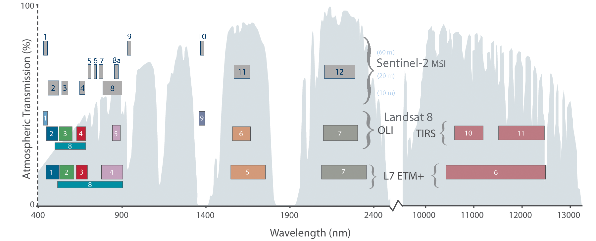

# Satellites - Image Collection {#Sat}

VICAL used the atmospherically corrected land surface reflectance images from Landsat (missions 4, 5, 7, 8 and 9, with images from 1982 to present) and Sentinel-2. Table \@ref(tab:Sat) shows the properties of these image collections in the GEE.

```{r Sat, echo=FALSE, message=FALSE, warning=FALSE,}
Sensor<-c("Landsat-4 TM",	"Landsat-5 TM",	"Landsat-7 ETM+",	"Landsat-8 OLI",	"Landsat-9 OLI-2",	"Sentinel-2 (MSI)")
Dataset.availability <-c("22/08/1982 - 24/06/1993",	"16/03/1993 – 05/05/2012",	"01/01/1999-present",	"11/04/2013- present",	"31/10/2021- present",	"28/03/2017-present")
Collection.ID<-c("LANDSAT/LT04/C02/T1_L2",	"LANDSAT/LT05/C02/T1_L2",	"LANDSAT/ LC08 /C02/T1_L2",	"LANDSAT/LE07/C02/T1_L2",	"LANDSAT/LC09/C02/T1_L2",	"COPERNICUS/S2_SR_HARMONIZED")

Sat<-data.frame(Sensor, Dataset.availability, Collection.ID)

knitr::kable(
  Sat, booktabs = TRUE, 
  caption = 'Image collection of Landsat and Sentinel-2 within the Google Earth Engine (GEE)'
) 
```

The location of the different spectral bands of these sensors is shown in Figure \@ref(fig:figS1). 
```{r figS1, fig.cap='Comparison of Landsat and Sentinel-2 and location of the spectral bands. The numbers indicate the number of spectral bands considered in each sensor [@NASA2021]', echo=FALSE, message=FALSE, warning=FALSE, fig.align = 'center'}

```

In VICAL, there are four calculation options in VICAL with these image collections: **(i) Landsat (7, 8 and 9), (ii) Sentinel-2, (iii) Landsat (7, 8 and 9) and Sentinel-2 and (iv) Landsat (4 and 5)**. 
