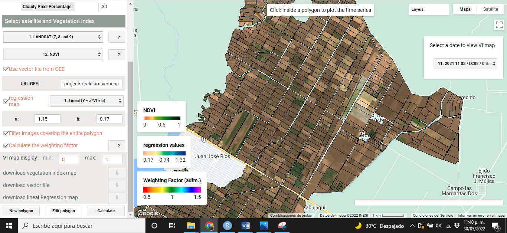
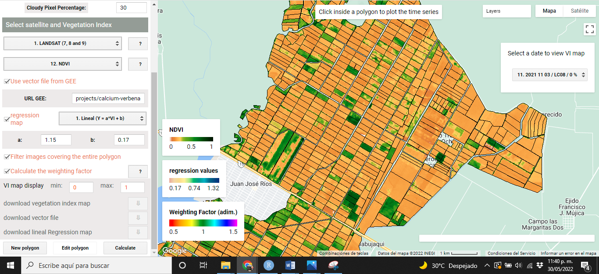
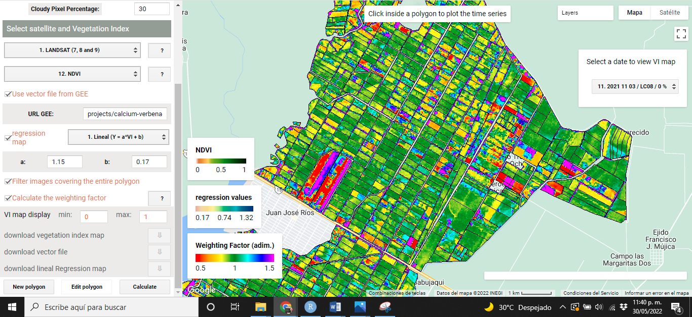
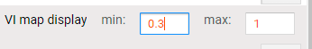
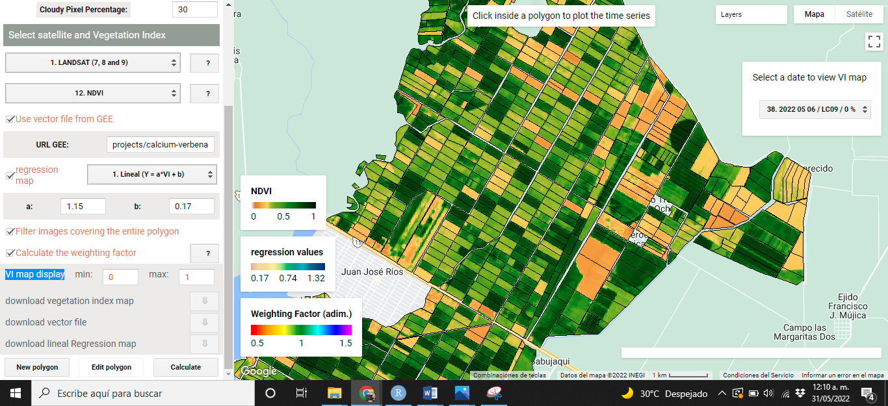
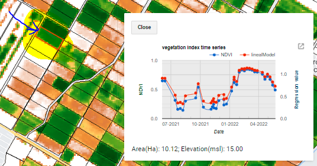
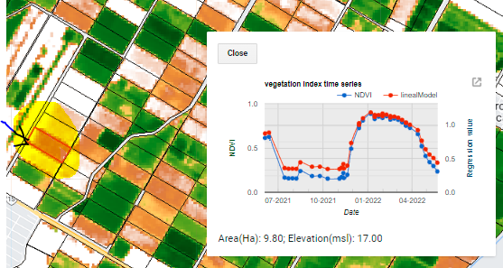
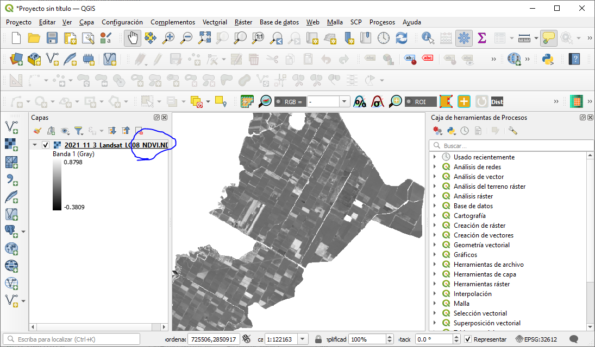

# Implementación

This section presents an example of how to navigate and how the VICAL results are displayed. 

## First views {#PriVis}
When VIs are calculated using VICAL, a minimum of three mandatory and optional layers are shown on the map: (i) RGB combination _(Figure \@ref(fig:figI1))_, (ii)the selected VI _(Figure \@ref(fig:figI2))_, (iii) weighting factor (optional) calculated for each polygon _(Figure \@ref(fig:figI3))_, (iv) the regression map (optional) _(Figure \@ref(fig:figI4))_ and (v) user drawn polygons. These maps, at first, are obtained from the first image found in the image collection.. 

The following images show some visualizations obtained from the URL that comes by default in VICAL ( _“Use vector file from GEE”_ was activated) and activating the linear regression option with coefficients of a=1.15 and b=0.17.
```{r figI1, fig.cap='RGB Combination',echo=FALSE, out.width="85%", message=FALSE, warning=FALSE, fig.align = 'center'}

```

```{r figI2, fig.cap='NDVI map',echo=FALSE, out.width="85%", message=FALSE, warning=FALSE, fig.align = 'center'}

```

```{r figI3, fig.cap='Weighting factor (optional)',echo=FALSE, out.width="85%", message=FALSE, warning=FALSE, fig.align = 'center'}

```

```{r figI4, fig.cap='Regression Map (optional)',echo=FALSE, out.width="85%", message=FALSE, warning=FALSE, fig.align = 'center'}

```

## Navigate between images 
VICAL creates a images collection defined by the user's configuration; therefore, the user can navigate between the found images. To do this, a bar appears on the upper right side, where clicking on it displays a list where each row represents an image. 

The short nomenclature used to name the images is: (Figure \@ref(fig:figI5)): _Image number found**+** point **+** Image date (starting with year, month and day)**+** / **+** Sensor **+** / **+** Cloud percentage in the image._ 
```{r figI5, fig.cap='List of images found',echo=FALSE, out.width="85%", message=FALSE, warning=FALSE, fig.align = 'center'}

```

Click on any row you want to view and the layers described in section \@ref(PriVis) will appear (Figure \@ref(fig:figI6)).
```{r figI6, fig.cap='Maps for the selected date',echo=FALSE, out.width="85%", message=FALSE, warning=FALSE, fig.align = 'center'}

```

## VI map display 
The user can change the display values of the VI map by changing the range in which the **maximum** and **minimum** value varies, for this, it is necessary to enter the values in the option _“VI map display”_ (Figure \@ref(fig:figI7)) and press the Enter key with the keyboard.

```{r figI7, fig.cap='IV map display setting',echo=FALSE, message=FALSE, warning=FALSE, fig.align = 'center'}

```

The program recognizes when the value is changed and automatically creates the layer with the new display values (Figure \@ref(fig:figI8)). It is possible to change these display values after the user has navigated between images. 

```{r figI8, fig.cap='NDVI with values in the range [0,1]',echo=FALSE, out.width="85%", message=FALSE, warning=FALSE, fig.align = 'center'}

```

```{r figI9, fig.cap='NDVI with values in the range [0.3,1]',echo=FALSE, out.width="85%", message=FALSE, warning=FALSE, fig.align = 'center'}

```

## Time series 
The VI time series is obtained by clicking inside any polygon, therefore, the values are only for the selected polygon. The time series is shown in a graph where the average and standard deviation of the IV values are calculated. each point of the graph represents an image found according to the user's configuration (Figure \@ref(fig:figI10) y (Figure \@ref(fig:figI11))).

```{r figI10, fig.cap='IV time series for the plot indicated',echo=FALSE, message=FALSE, warning=FALSE, fig.align = 'center'}

```
```{r figI11, fig.cap='IV time series for the plot indicated',echo=FALSE, message=FALSE, warning=FALSE, fig.align = 'center'}

```

## Download information 
Three layers of the five shown on the map can be downloaded. Download buttons are displayed at the bottom of the configuration section (Figure \@ref(fig:figI12)). The layers that can be downloaded are:
```{r figI12, fig.cap='download options',echo=FALSE, message=FALSE, warning=FALSE, fig.align = 'center'}

```

**i) VI map:** The Raster image is downloaded with VI values calculated and cropped for the area of interest. The download is done in TIF format, which can be viewed, for example, in QGIS _(Figure \@ref(fig:figI13))_. 

**ii) vector file:** The digitized polygon is downloaded in kml format, which can be viewed, for example, in Google Earth. 

**iii) regression map:** This option is available if “regression map” is activated; the raster image is downloaded with values of the regression map and cropped for the area of interest, the download is done in TIF format that can be viewed, for example, in QGIS.

```{r figI13, fig.cap='NDVI image displayed in QGIS',echo=FALSE, out.width="85%", message=FALSE, warning=FALSE, fig.align = 'center'}

```
