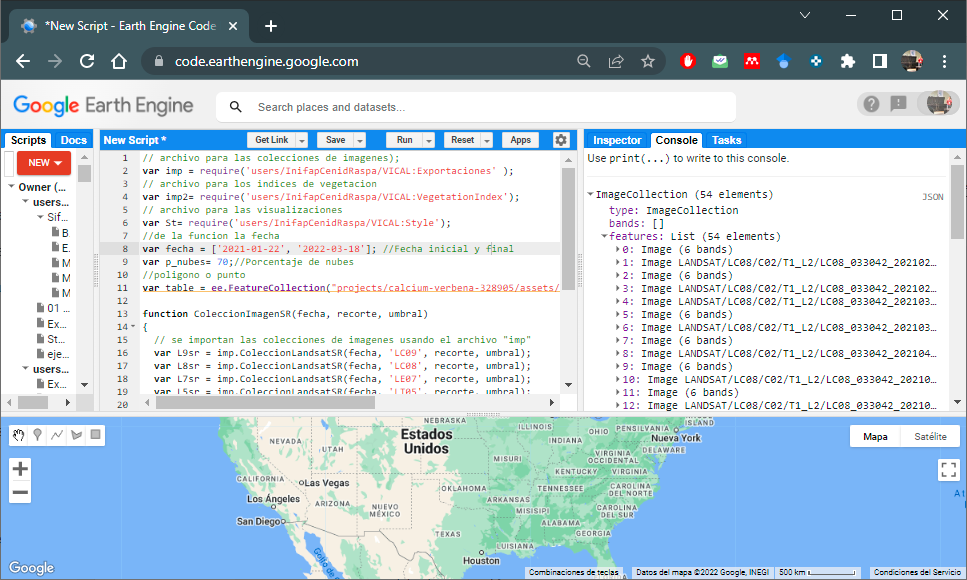
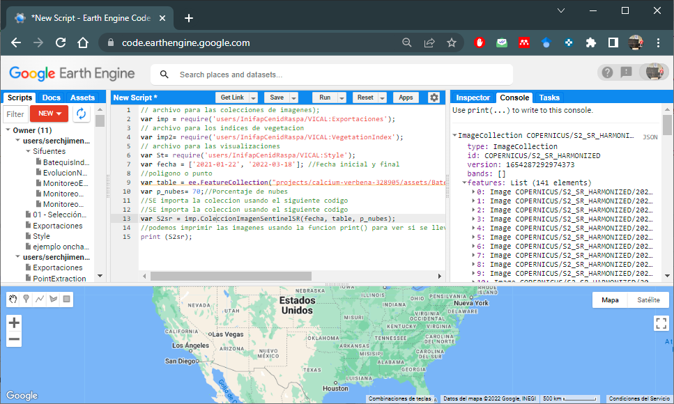
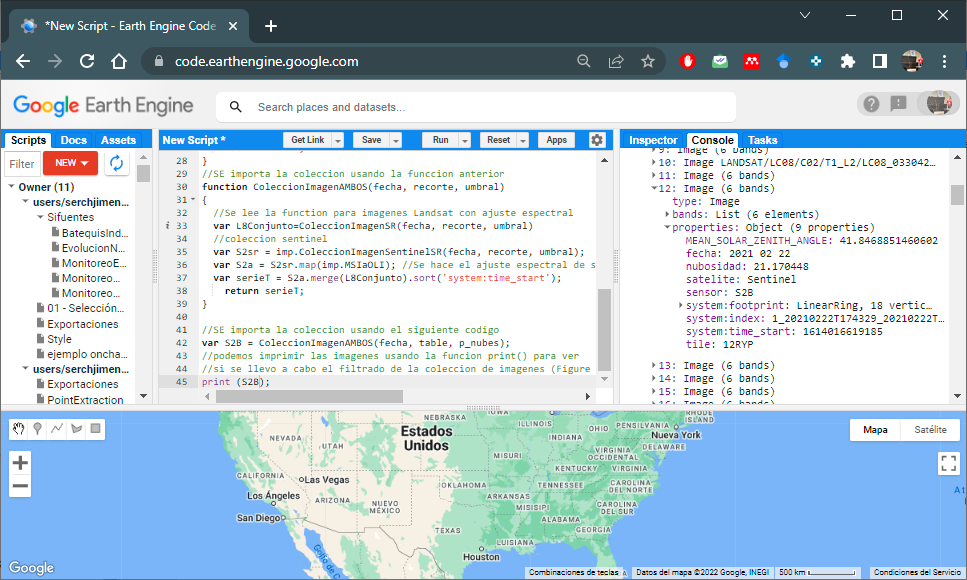
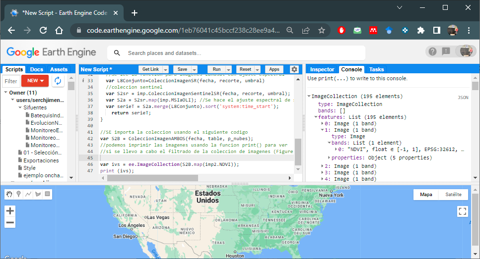
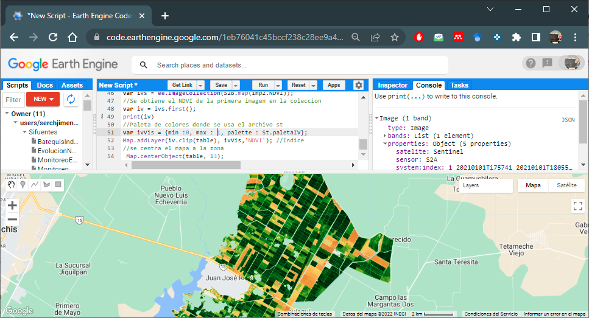

# VICAL in GEE

This section shows how to use the VICAL scripts to implement them in GEE. 

VICAL has three main files that can be imported into a GEE Script, these are: 

```{js }
// Image collections
var imp = require('users/InifapCenidRaspa/VICAL:Exportaciones');
// Vegetation indices
var imp2= require('users/InifapCenidRaspa/VICAL:VegetationIndex'); 
// visualization styles
var St= require('users/InifapCenidRaspa/VICAL:Style');

```

## Image collection {#CImg}
Before importing the image collections, some variables must be declared that are useful for filtering this collection: i) a point or polygon; ii) date range, and iii) cloud threshold value in images. These declarations are shown in the following code: 
```{js }
var fecha = ['2021-01-01', '2022-03-18']; //Start and end date 
//polygon or point
var table = ee.FeatureCollection("projects/calcium-verbena-328905/assets/Bate");

var p_nubes= 30;//percentage of clouds
```

### Landsat
If you want to use cloud-free atmospherically corrected LandSat images (4, 5, 7, 8 and 9), you can use the following code. A function is created to join the image collections. To do this, use the **_imp_** file. 
```{js }
function ColeccionImagenSR(fecha, recorte, umbral)
{
  // image collections are imported using the "imp" file
  var L9sr = imp.ColeccionLandsatSR(fecha, 'LC09', recorte, umbral);
  var L8sr = imp.ColeccionLandsatSR(fecha, 'LC08', recorte, umbral);
  var L7sr = imp.ColeccionLandsatSR(fecha, 'LE07', recorte, umbral);
  var L5sr = imp.ColeccionLandsatSR(fecha, 'LT05', recorte, umbral);
  var L4sr = imp.ColeccionLandsatSR(fecha, 'LT04', recorte, umbral);
  //ETM and ETM+ data are spectral fit to OLI and OLI-2 
  var L7a = L7sr.map(imp.TMaOLI);
  var L5a = L5sr.map(imp.TMaOLI);
  var L4a = L4sr.map(imp.TMaOLI);
  // Join collections
  var serieT =L9sr.merge(L8sr).merge(L7a).merge(L5a).merge(L4a).sort('system:time_start');
	return serieT;
}
//The collection is imported using the previous function 
var l8Sergio=ColeccionImagenSR(fecha, table, p_nubes);
//we can print the images using the print() function to see if the 
//filtering of the image collection has been carried out (Figure 6.1) 
print (l8Sergio);

```

With these image collections, time series of different vegetation indices can be calculated.

```{r figV1, fig.cap='Landsat Image Collection',echo=FALSE, out.width="85%", message=FALSE, warning=FALSE, fig.align = 'center'}

```

### Sentinel-2
If you want to use cloud-free, atmospherically corrected Sentinel-2 images, you can use the following code.
```{js }
//The collection of images is imported using the following code
var S2sr = imp.ColeccionImagenSentinelSR(fecha, table, p_nubes);
//we can print the images using the print() function to see if the 
//filtering of the image collection has been carried out (Figure 6.2)
print (S2sr);
```

```{r figV2, fig.cap='Sentinel-2 Image Collection',echo=FALSE, out.width="85%", message=FALSE, warning=FALSE, fig.align = 'center'}

```


### Landsat y Sentinel-2 {#LanSen}
If you want to use cloud-free, atmospherically corrected LandSat and Sentinel-2 images, you can use the following code, data were spectrally fit to Landsat 8 bands. The functions described in Section \@ref(CImg):
```{js }
function ColeccionImagenAMBOS(fecha, recorte, umbral)
{
  //Function for Landsat images with spectral adjustment
  var L8Conjunto=ColeccionImagenSR(fecha, recorte, umbral)
  //Sentinel
  var S2sr = imp.ColeccionImagenSentinelSR(fecha, recorte, umbral);
  //Spectral matching of sentinel-2 to Landsat
  var S2a = S2sr.map(imp.MSIaOLI); 
  var serieT = S2a.merge(L8Conjunto).sort('system:time_start');
	return serieT;
}

//The collection is imported
var S2B = ColeccionImagenAMBOS(fecha, table, p_nubes);
//we can print the images using the print() function to see if the 
//filtering of the image collection has been carried out (Figure 6.3)
print (S2sr);

```

```{r figV3, fig.cap='Landsat and Sentinel-2 imagery collection',echo=FALSE, out.width="85%", message=FALSE, warning=FALSE, fig.align = 'center'}

```

To view an example script click [here](https://code.earthengine.google.com/1eb76041c45bccf238c28ee9a4bad955)

## Vegetation indices
To calculate some of the VIs of **VICAL** you have to use the file **imp2**; and these VIs are imported using the names of the **ExpresionGEE** column that are shown in the **Table \@ref(tab:Index)**.

For example, to calculate NDVI with LandSat and Sentinel-2 images from section \@ref(LanSen), the following code would be used:

```{js }
//Normalized Difference Vegetation Index- NDVI
var ivs = ee.ImageCollection(S2B.map(imp2.NDVI));
//Print and view the NDVI band
print (ivs);
```

Figure \@ref(fig:figV4) shows a single band called **NDVI**, calculated with the collection of images of the harmonized set
```{r figV4, fig.cap='NDVI Band Image Collection', echo=FALSE, out.width="85%", message=FALSE, warning=FALSE, fig.align = 'center'}

```

The following code shows an example to display on the map the **NDVI** of the first image of the collection and cropped for the area. The **st** file of ¨**VICAL** is used. 

```{js }
//NDVI from the first image in the collection
var iv = ivs.first();
//Color palette where 'st' file is used
var ivVis = {min :0, max : 1, palette : St.paletaIV};
Map.addLayer(iv.clip(table), ivVis,'NDVI'); //Indice
//the map is centered to the area
 Map.centerObject(table, 13);
```

Figure \@ref(fig:figV6) shows the NDVI map for the area of interest

```{r figV6, fig.cap='NDVI map for the area of interest', echo=FALSE, out.width="85%", message=FALSE, warning=FALSE, fig.align = 'center'}

```
To view the sample code click [here](https://code.earthengine.google.com/299b022150c4569d006b323931f8d828)

If you want to display the NDVI of a particular image, you must convert it to a list. 

```{r  Index, echo=FALSE, message=FALSE, warning=FALSE,}
Number<-c(	"1",	"2",	"3",	"4",	"5",	"6",	"7",	"8",	"9",	"10",	"",	"11",	"12",	"13",	"14",	"15",	"16",	"17",	"18",	"19",	"20",	"21",	"22",	"23")
Index<-c("Atmospherically resistant vegetation index",	"Adjusted transformed soil-adjusted vegetation index",	"Difference vegetation index",	"Enhanced vegetation index",	"Enhanced vegetation index",	"Green normalized difference vegetation index",	"Modified soil adjusted vegetation index",	"Moisture stress index",	"Modified triangular vegetation index",	"Modified triangular vegetation index-2",	"",	"Normalized difference tillage index (NDTI)",	"Normalized difference vegetation index",	"Normalized difference water index",	"Optimized soil adjusted vegetation index",	"Renormalized difference vegetation index",	"Redness index",	"Ratio vegetation index",	"Soil adjusted vegetation index",	"Triangular vegetation index",	"Transformed soil adjusted vegetation index",	"Visible atmospherically resistant index",	"Vegetation index number or simple ratio",	"Wide dynamic range vegetation index")
Abbreviation<-c("ARVI*",	"ATSAVI*",	"DVI",	"EVI",	"EVI2*",	"GNDVI",	"MSAVI2",	"MSI",	"MTVI",	"MTVI2",	"",	"NDTI",	"NDVI",	"NDWI",	"OSAVI*",	"RDVI",	"RI",	"RVI",	"SAVI*",	"TVI",	"TSAVI*",	"VARI",	"VIN",	"WDRVI*")
ExpresionGEE<-c("ARVI",	"ATSAVI",	"DVI",	"EVI",	"EVI2",	"GNDVI",	"MSAVI2",	"MSI",	"MTVI",	"MTVI2",	"",	"NDTI",	"NDVI",	"NDWI",	"OSAVI",	"RDVI",	"RI",	"RVI",	"SAVI",	"TVI",	"TSAVI",	"VARI",	"VIN",	"WDRVI")
Coefficients<-c("γ=1.0",	"",	"",	"C1=6.0, C2= 7.5; L=1.0",	"C1=2.4",	"",	"",	"",	"",	"",	"",	"",	"",	"",	"X=0.16",	"",	"",	"",	"L=0.5",	"",	"a= 1 ; b=0; ",	"",	"",	"α=0.2")
Index<-data.frame(Number, Index, Abbreviation, ExpresionGEE,Coefficients)

knitr::kable(
  Index, booktabs = TRUE, align = "lcccc",
  caption = 'Code of vegetation indices considered in VICAL'
)
```
## GithUb repository
VICAL codes are written in JavaScript and are freely available on GitHub (https://www.github.com/CenidRaspaRiego/VICAL (accessed on 16 June 2022))
