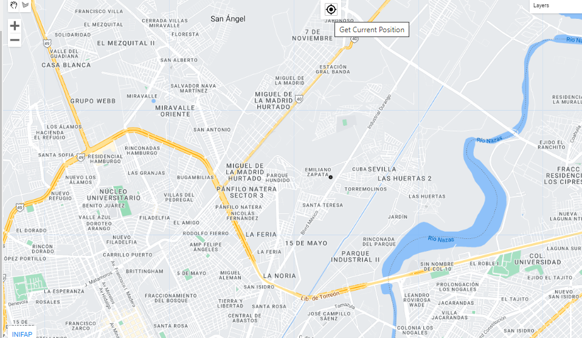

# Updates
f you have questions or find that updates introduce errors, please post an issue in the VICAL GitHub repository - if you don’t have a GitHub account, email Sergio at: jimenez.sergio@inifap.gob.mx.

## May 02, 2022

-The user can enter the **URL** (ID) of a vector file uploaded from GEE.
-The digitized polygon can be exported in _.kml._ format

## September 15, 2022

**Vegetatión index**: The Green Chlorophyll Vegetation Index (GCVI) was added
$$
GCVI = \frac{NIR}{G}-1;     
$$
```{r figA0, fig.cap='GCVI map', echo=FALSE, message=FALSE, warning=FALSE, fig.align = 'center'}
knitr::include_graphics("./images/FigureA0.png")
```
## October 4, 2022

**Select the satellite and sensor**:For the first option, the user can select if he wants to work with the complete Landsat image collection (5,7, 8 and 9) or separately. If the options **“L-5 and L-7”** and **“L-8 and L-9”** is selected, ETM+ data are spectrally adjusted to OLI spectral bands using Roy et al., (2016). If only one of the two options (“L-5 and L-7” and “L-8 and L-9”) is selected, no spectral adjustment is made. 
```{r figA1, fig.cap='Landsat Satellite Image Collection', echo=FALSE, message=FALSE, warning=FALSE, fig.align = 'center'}
knitr::include_graphics("./images/FigureA1.png")
```

## November 1, 2022
The user can calculate the statistical values of the vegetation index in each pixel, all the images found in the defined interval are used. The options are shown in the following Figure. For the **NONE** option, the vegetation index (VI) is calculated for each pixel and for each image found in the defined interval. A list of images is displayed, therefore it is possible to calculate the VI time series and download the images by date. 
```{r figA2, fig.cap='statistical value options', echo=FALSE, message=FALSE, warning=FALSE, fig.align = 'center'}
knitr::include_graphics("./images/FigureA2.png")
```

For the **NONE** option, the vegetation index (VI) is calculated for each pixel and for each image found in the defined interval. A list of images is displayed, therefore it is possible to calculate the VI time series and download the images by date. While, for the other options, the result in a single image with the statistical values in the period.
```{r figA3, fig.cap='Statistical pixel values from November 2021 to November 2022', echo=FALSE, message=FALSE, warning=FALSE, fig.align = 'center'}
knitr::include_graphics("./images/FigureA3.png")
```

## November 4, 2022
-User can get their current location when opening VICAL.

```{r figA4, fig.cap='get current location', echo=FALSE, message=FALSE, warning=FALSE, fig.align = 'center'}

```
-It is possible to minimize and maximize the options panel so that it can be used on mobile phones.
```{r figA5, fig.cap='Minimize and maximize panel button', echo=FALSE, message=FALSE, warning=FALSE, fig.align = 'center'}
knitr::include_graphics("./images/FigureA5.png")
```
```{r figA6, fig.cap='VICAL on a cell phone', echo=FALSE, message=FALSE, warning=FALSE, fig.align = 'center'}
knitr::include_graphics("./images/FigureA6.png")
```
